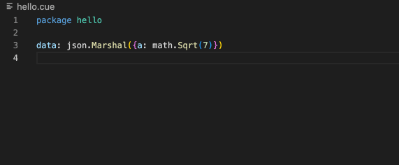

# Cue for Visual Studio Code

The VS Code Cue extension provides language support for the [CUE](https://github.com/cue-lang/cue) data validation language.

## Features

- Code formatting
- Automatic imports management using [cueimports](https://github.com/asdine/cueimports)
- Syntax highlightimg
- Package linting

## Requirements

This extension requires the `cue` binary.

## Extension Settings

This extension contributes the following settings:

- `cue.formatTool`: Tool to use for formatting code. Either `cueimports` or `cue fmt`
- `cue.lintOnSave`: Lints code on file save using `cue vet`. Either `package` or `none`.
- `cue.lintFlags`: Flags to pass to `cue vet` (e.g. ["-c"])
- `cue.toolsPath`: Path to the directory containing the tools installed by the extension (e.g. cueimports, etc...). If not set, the extension will use the $HOME/.bin directory. This directory must be in your PATH.
